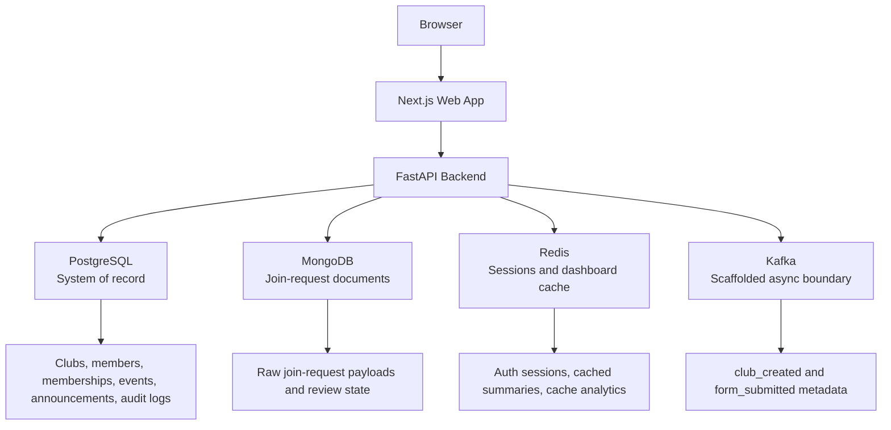
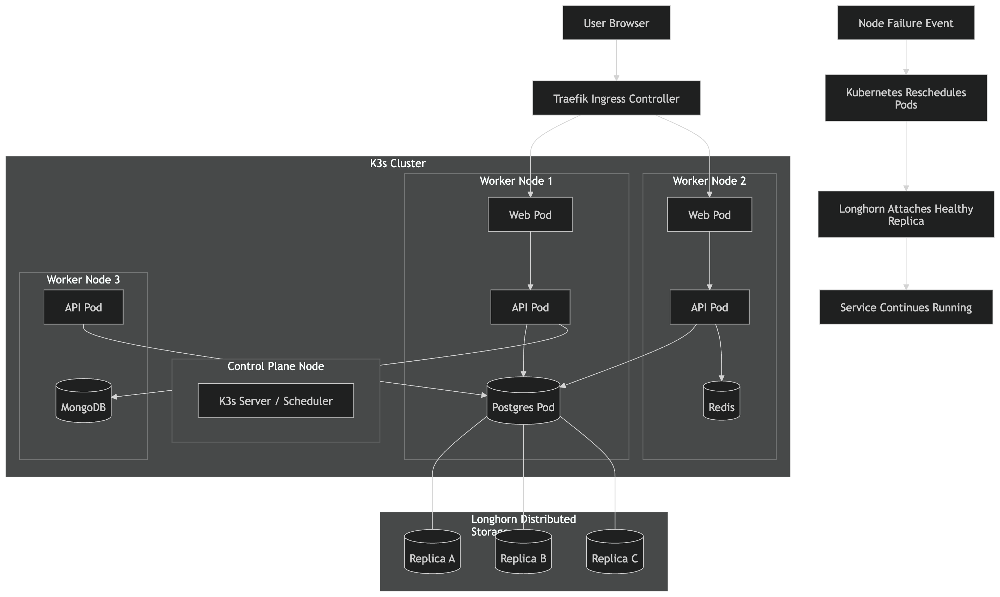

# ClubCRM Final Project Development Writeup

ClubCRM is a club-management platform built as a devcontainer-first monorepo with a Next.js frontend, a FastAPI backend, and a polyglot persistence layer. The main design goal was to build a realistic administrative system without overcomplicating the codebase. Instead of splitting the application into microservices, the project stayed a modular monolith: one web app, one API, and several purpose-specific data systems behind the backend. That decision made it easier to explain the architecture, build the MVP, and demonstrate how different database technologies can work together in one product.

The multi-database architecture uses PostgreSQL, MongoDB, Redis, and Kafka. PostgreSQL is the system of record for structured business data such as clubs, members, memberships, events, announcements, authorization data, and audit logs. It was chosen because those entities have strong relationships, benefit from constraints, and need transactional consistency. MongoDB was chosen for join-request documents because those payloads are flexible and may evolve by club or workflow without forcing immediate normalization into relational tables. Redis was chosen for short-lived data, especially backend auth sessions and dashboard summary caching, because those values are fast-changing, disposable, and performance-sensitive. Kafka was chosen as the intended event boundary for asynchronous workflows; in the current implementation, the publisher adapters are scaffolded and record event metadata in memory instead of sending messages to the broker.

Figure 1 shows the core tech-demo architecture already documented in the repository. It captures the same system shape implemented in the code: browser to Next.js, Next.js to FastAPI, and FastAPI to the four data systems.

To make the architecture easier to read at the application level, Figure 2 summarizes the same design in Mermaid.

This architecture works because each database has a clear responsibility instead of overlapping randomly. PostgreSQL was selected for the most important business records because ClubCRM needs stable identifiers, joins, ownership relationships, and safe updates. For example, a club belongs to an organization, a member can participate in multiple clubs, and audit records need to stay queryable over time. Those are relational concerns, so PostgreSQL is the natural fit. MongoDB was selected for join requests because the backend preserves the incoming payload as a document. In the current implementation, the `join_requests` collection stores identifiers such as `organizationId` and `clubId`, the submitter object, the flexible `payload`, and workflow state like `pending`, `approved`, or `denied`. Redis was selected because caching and sessions should be fast and easy to expire. ClubCRM stores auth sessions in Redis with a TTL, and dashboard summaries are cached for 90 seconds so repeat reads can be served quickly without changing the canonical record. Kafka remains useful for the intended demo and future asynchronous processing, but today it is best described as a prepared boundary rather than a fully operational event-stream integration.

The data flow between these systems follows a “primary write, then supporting systems” pattern. The simplest example is the dashboard flow. When the frontend requests a club dashboard, the FastAPI backend first checks Redis for a cached summary. If the cache has an entry, the API returns it immediately and increments Redis metrics such as hits and requests. If Redis misses, the API queries PostgreSQL for the canonical dashboard data, returns that result, and writes it back to Redis with a short TTL. In other words, PostgreSQL owns correctness, while Redis accelerates repeated reads. This keeps cache behavior helpful but non-critical.

The join-request flow shows how MongoDB and the async boundary fit into the same architecture. A public user submits a join request from the web app, the request reaches the FastAPI forms module, and the backend stores the raw request document in MongoDB. After the document is saved, the same use case invokes a form-submission publisher port; the current adapter records event metadata in memory, leaving the broker-backed Kafka implementation as future work. Later, when an admin or club manager reviews pending requests, the system reads and updates the workflow state from MongoDB. This division is intentional: MongoDB keeps the flexible submission payload, while the publisher boundary marks where asynchronous workflows or observability can attach.

Club creation demonstrates another path. A user action from the frontend reaches the backend clubs module, which writes the new club into PostgreSQL. After that succeeds, the backend can record the action in the PostgreSQL-backed audit log and invoke a club event publisher at the async boundary. This pattern makes the data flow easy to reason about: durable business truth first, then secondary side effects. In practice, the architecture avoids the common mistake of making the event bus the only source of truth.

Figure 3 connects the application architecture to the deployment-side tech demo. The networking demo uses a clustered environment and a failover story, but it still preserves the same application boundaries. That matters because the infrastructure demo supports the database project instead of replacing it.

Several challenges came up during development. The first was deciding how to use multiple databases without creating confusion. Early on, it would have been easy to let MongoDB become a general-purpose fallback or let Redis quietly become a data store. The team solved that by documenting explicit responsibilities in architecture notes and implementation guides: PostgreSQL for the relational system of record, MongoDB for flexible form documents, Redis for disposable cache and session data, and Kafka for asynchronous publication. Those boundaries made later feature work much easier because contributors could ask “what kind of data is this?” before writing code.

The second challenge was frontend and backend drift. The web app moved quickly, so some UI-first work existed before the backend contracts were fully implemented. That created temporary gaps between what the screens expected and what the API actually returned. The solution was to keep the frontend modular, expand the live API route surface, and gradually replace placeholder view-model logic with real backend-backed flows. By the current project state, authentication, dashboard summaries, club and member management, announcements, events, and join-request review all use real backend routes.

The third challenge was environment reliability. This project depends on several supporting services, so local setup could have become fragile. The team addressed that by standardizing on the repository devcontainer, generating host-port mappings automatically, keeping root-level `pnpm` scripts as the workflow contract, and letting Docker Compose start the web app, API, PostgreSQL, MongoDB, Redis, and Kafka together. That decision turned a potentially error-prone setup into a reproducible demo environment.

Overall, ClubCRM’s multi-database architecture is successful because it is deliberate rather than fashionable. PostgreSQL was chosen for correctness and relational integrity. MongoDB was chosen for flexible submission documents. Redis was chosen for speed and expiration-based state. Kafka was chosen for asynchronous event boundaries. Data flows from the frontend to the FastAPI backend, then into the most appropriate persistence layer, with Redis and Kafka acting as supporting systems rather than competing sources of truth. The result is a system that is easier to explain, easier to demo, and better aligned with the actual access patterns of the application.

## References

1. ClubCRM repository documentation, [Architecture and Development Rules](../architecture.md).
2. ClubCRM repository documentation, [Architecture Decision Record](../decisions.md).
3. PostgreSQL Global Development Group, [PostgreSQL Documentation](https://www.postgresql.org/docs/).
4. MongoDB, [What is MongoDB?](https://www.mongodb.com/docs/v6.1/introduction/) and [Data Modeling in MongoDB](https://www.mongodb.com/docs/upcoming/data-modeling/).
5. Redis, [Caching at Scale with Redis](https://redis.io/wp-content/uploads/2021/12/caching-at-scale-with-redis-updated-2021-12-04.pdf).
6. Apache Kafka, [Introduction to Apache Kafka](https://kafka.apache.org/35/getting-started/introduction/).
