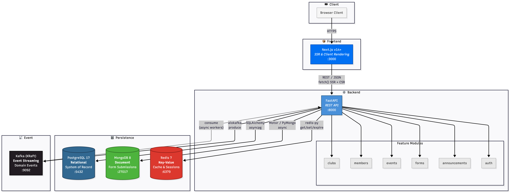

# ClubCRM Frontend and Multi-Database Development Environment

ClubCRM is a club-management platform built as a modular monolith with a Next.js frontend, a FastAPI backend, and a polyglot persistence layer. This writeup focuses on the frontend and the development environment, but it also explains how those layers connect to the project’s multi-database backend. The main architectural idea is simple: the browser interacts with one web application, the web application relies on one backend, and the backend routes each workload to the storage technology that best fits that workload. That design lets the demo stay easy to navigate while still demonstrating realistic database specialization.

The frontend lives in `apps/web` and uses the Next.js App Router. The public routes currently cover `/`, `/login`, `/not-provisioned`, `/docs`, `/testing`, `/join/[clubId]`, and `/demo/failover`, while the protected application surface provides dashboard, profile, clubs, members, audit, and diagnostics screens. The root route `/` is a public landing page that checks the backend-owned auth session only to tailor its primary actions, while the admin shell handles the actual protected redirects to `/dashboard`, `/not-provisioned`, or `/login` as needed. This route structure makes the tech demo easier to explain because it supports both public and administrative workflows in one application. It also matches the modular direction of the repo: routes compose feature-owned logic from `src/features`, which keeps domain behavior grouped by responsibility instead of scattering it across unrelated components.

The protected experience is also role-aware. Organization admins can see the full workspace, including audit and diagnostics surfaces, while club managers get a reduced navigation focused on their assigned clubs. That matters for the demo because it shows that the frontend is not just a collection of static pages. It is a real interface on top of backend authorization, club management, roster workflows, and diagnostics. Figure 1 anchors that explanation in the actual project assets already stored in the repository.

Figure 1. ClubCRM system diagram from the project tech demo.



The frontend stays readable because the backend absorbs the multi-database complexity. ClubCRM uses PostgreSQL, MongoDB, Redis, and Kafka, but each technology has a limited and intentional role. PostgreSQL is the system of record for relational business data. Club records, members, memberships, announcements, events, authorization mappings, and audit logs all have relationships and consistency requirements that benefit from foreign keys, constraints, indexed lookups, and transactional updates. In this project, PostgreSQL is the right choice for data that must remain authoritative and queryable across multiple modules.

MongoDB is used for join-request document storage. Public join requests are submitted through the frontend and stored as documents in a `join_requests` collection. This is a good fit because these submissions are form-shaped payloads rather than the canonical relational model of the system. The current payload is still fairly narrow, but it is still more naturally represented as a document than as a cluster of relational tables. MongoDB was therefore chosen for flexibility at the form boundary while PostgreSQL remains the source of truth for members and club administration after a request is approved.

Redis is used for two concrete responsibilities in the current codebase: backend auth sessions and dashboard caching. Auth session records are stored with a time-to-live, and dashboard summary results are cached in Redis with cache metrics such as hits, misses, refreshes, and invalidations. This makes Redis the correct fit for short-lived, high-speed state that can either expire naturally or be rebuilt from authoritative sources. In other words, Redis improves responsiveness without replacing the underlying source of truth in PostgreSQL.

Kafka is present in the architecture as the event boundary, but the current implementation is important to describe accurately. The application already wires club and form submission publishers through the dependency layer, and those publishers are invoked from the relevant commands. However, the current publisher implementations do not yet send messages to the Kafka broker. Instead, they record event metadata in memory. That means Kafka is part of the intended architecture and the development environment, but in the present code it is better described as a scaffolded async boundary rather than a fully operational event-stream integration.

This separation of responsibilities is what makes the architecture understandable instead of just complex. PostgreSQL handles correctness and durable relational state. MongoDB handles document-shaped join requests. Redis handles temporary session and cache state. Kafka marks the boundary where asynchronous publication is intended to happen as the project grows. Because those boundaries are clear, the frontend can stay relatively simple: it calls the API, and the API decides which persistence mechanism owns the work.

Figure 2 summarizes the current application data flow.

```text
Browser
  |
  v
Next.js frontend
  |
  v
FastAPI backend
  |
  +--> PostgreSQL  (clubs, members, memberships, events, announcements, auth mappings, audit logs)
  +--> MongoDB     (join-request documents)
  +--> Redis       (auth sessions, dashboard summary cache)
  +--> Kafka       (planned async event boundary; publishers currently scaffolded)
```

Three concrete workflows show how the systems fit together. The first is the dashboard flow. A signed-in user opens the admin shell and requests dashboard data. The backend checks Redis for a cached summary. If that cache is present, the response returns quickly. If the cache is missing, the backend calculates the summary from PostgreSQL, returns it to the frontend, and stores the result in Redis with a short time-to-live. This pattern improves perceived speed while keeping PostgreSQL as the canonical source for club totals.

The second workflow is the join-request flow. A public visitor uses `/join/[clubId]` in the Next.js app to submit a request to join a club. The FastAPI forms module validates the request, looks up the target club through the relational repository, and saves the request as a MongoDB document. Later, an authorized admin or club manager can review pending requests through the protected frontend. If the request is approved, the backend updates the join-request document status, creates the actual member and membership records in PostgreSQL when needed, invalidates relevant Redis dashboard cache entries, and records the administrative action in the audit log. This is the clearest example of data moving between database systems: MongoDB stores the intake document, PostgreSQL stores the resulting durable membership state, and Redis is updated because the club summary may have changed.

The third workflow is club creation. An authorized admin creates a club through the frontend. The API writes the club to PostgreSQL first because that is the authoritative system of record. After that, the backend invalidates dashboard cache entries and records the action in the PostgreSQL-backed audit log. The code also invokes a club event publisher at that point. In the future, that boundary is where Kafka-backed asynchronous side effects could live, but today it is more accurate to say the project has prepared for event publication than to say it already runs full Kafka-driven consumers.

The development environment was designed to make this architecture practical. A project that depends on four different backing technologies can quickly become fragile if every teammate installs tools separately or starts services by hand. ClubCRM avoids that by using a devcontainer-first workflow. The repository is mounted at `/workspace`, the post-create setup bootstraps dependencies, and Docker Compose starts the local stack. That stack includes the web app, API, PostgreSQL, MongoDB, Redis, and Kafka. Because the full stack comes up together, the frontend can be tested against real backend dependencies instead of isolated mocks.

This environment also improves portability. The repository generates `.devcontainer/docker-compose.ports.yml` during startup so default host ports such as `3000`, `8000`, `5432`, `27017`, `6379`, and `9092` can shift automatically if a machine already has conflicts. Docker volumes persist the PNPM store, `node_modules`, `.next`, and the API virtual environment so rebuilds stay reasonably fast. The overall result is that the demo is much easier to run consistently on different machines.

Several challenges shaped the current design. One challenge was frontend-backend drift. Because the frontend moved quickly as a UI-first MVP, some views existed before the backend contracts were complete. That risked producing a polished interface that did not truly reflect the live application. The team addressed this by organizing the frontend around feature-owned server modules and gradually replacing placeholder behavior with real API integrations. As the backend matured, auth checks, diagnostics, dashboard summaries, club and member flows, audit views, and join-request review were connected to live routes.

Another challenge was keeping the polyglot persistence model coherent. Multi-database architectures can become confusing when responsibilities overlap. ClubCRM reduced that risk by giving each technology a narrow job and documenting those boundaries in the repo architecture materials. That decision made the writeup stronger and the demo easier to explain, because there is a concrete answer to why a given feature uses a given store.

The last challenge was being honest about implementation maturity. It is easy in a final project writeup to describe the ideal architecture instead of the actual one. In ClubCRM, Kafka is the best example of that tension. The broker is provisioned in the environment and publisher interfaces are already wired into application commands, but the current publisher implementations are still scaffolds rather than full broker-backed producers. Describing that limitation clearly is important because it shows architectural intent without overstating what the demo already does.

Overall, ClubCRM’s frontend and development environment are successful because they reinforce the same architectural decisions. The Next.js app gives the project a clear and role-aware interface for both public and administrative workflows. The devcontainer makes the full stack predictable enough to run reliably during development and demonstration. Underneath that, the multi-database backend uses each technology for a specific reason: PostgreSQL for durable relational truth, MongoDB for join-request documents, Redis for session and cache state, and Kafka as a prepared async boundary that can be expanded later. That combination gives the project a realistic and defensible architecture while staying honest about the current codebase.

## References

1. ClubCRM repository documentation, [Architecture and Development Rules](../architecture.md).
2. ClubCRM repository documentation, [Contributing Guide](../contributing.md).
3. ClubCRM repository documentation, [Web App README](../../apps/web/README.md).
4. PostgreSQL Global Development Group, [PostgreSQL Documentation](https://www.postgresql.org/docs/).
5. MongoDB, [MongoDB Data Modeling Introduction](https://www.mongodb.com/docs/manual/data-modeling/).
6. Redis, [Redis Caching](https://redis.io/solutions/caching/).
7. Apache Kafka, [Apache Kafka Documentation](https://kafka.apache.org/documentation/).
