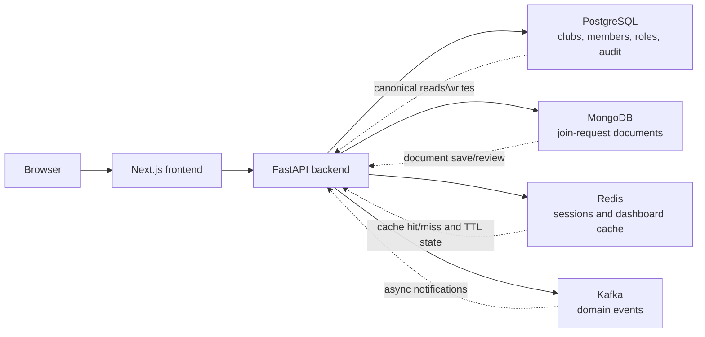

# ClubCRM Frontend and Development Environment Writeup

ClubCRM is a club-management platform built as a modular monolith with a Next.js frontend, a FastAPI backend, and a polyglot persistence layer. This writeup is focused on my assigned areas in the final project: the frontend and the development environment. To explain those sections clearly, I also connect them to the multi-database architecture behind the demo. The core idea is straightforward: the browser talks to one web application, the web application talks to one backend, and the backend writes to the database system that best matches the shape and lifetime of the data. This approach made it possible to build a realistic application while still showing why multiple database technologies were useful.

The frontend was intentionally built as a UI-first MVP in `apps/web` using Next.js App Router. The public entry points handle login, not-provisioned messaging, and club join requests, while the protected admin shell provides dashboard, profile, clubs, members, audit, and system-health pages. This frontend design was chosen because it makes the demo easy to navigate: a user can move from authentication to operational screens quickly, and instructors can see both public and admin workflows from the same application. The route structure also reflects the project’s modular goals. Admin pages live under the `(app)` route group, public pages live under `(public)`, and feature-owned modules under `src/features` keep domain logic grouped by business responsibility instead of scattering API calls across unrelated components.

That frontend structure matters because ClubCRM is not just a static interface. It is the entry point into a multi-database backend. Figure 1 shows the broader tech-demo architecture already captured in the repository. The screenshot helps anchor the writeup in the actual demo rather than an abstract design.

At the backend layer, ClubCRM uses PostgreSQL, MongoDB, Redis, and Kafka, but each one has a narrow role. PostgreSQL was chosen as the system of record because club management data is relational by nature. Clubs belong to organizations, members can have multiple memberships, role assignments affect authorization, and audit logs need durable, queryable history. Those patterns benefit from primary keys, foreign keys, joins, constraints, and transactional updates, which makes PostgreSQL the strongest fit.

MongoDB was chosen for flexible join-request and form-style payloads. Public submissions can vary over time as clubs ask for different information, so preserving a document-shaped request avoids forcing every field into a rigid relational schema too early. This gave the project flexibility during iteration while still keeping the canonical club, member, and authorization records in PostgreSQL. Redis was chosen for speed-sensitive, short-lived state. In the current design, Redis supports backend sessions and dashboard caching, which are both expiration-friendly and performance-oriented workloads. Kafka was chosen as the event boundary for asynchronous workflows. It is useful for publishing business events such as a club being created or a form being submitted, but it does not replace the main system of record.

The key benefit of this architecture is that every database choice is tied to a data responsibility. PostgreSQL handles correctness. MongoDB handles schema-flexible documents. Redis handles disposable and cacheable state. Kafka handles asynchronous publication. Because those boundaries are documented and intentional, the frontend can remain simple: it talks to the API, and the API decides where the data belongs.

Figure 2 summarizes that interaction in Mermaid and shows how data flows between the systems.

Several concrete flows show why this arrangement works. In the dashboard flow, a signed-in user reaches the admin shell in the Next.js app and requests dashboard data. The FastAPI backend first checks Redis for a cached summary. If a cached value exists, the result returns quickly and avoids extra database load. If the cache misses, the backend reads the canonical numbers from PostgreSQL, returns them to the frontend, and stores the fresh summary in Redis with a short time-to-live. This is a good example of how the frontend and database architecture support each other: the dashboard feels fast to the user, but correctness still comes from PostgreSQL rather than the cache.

The public join-request flow demonstrates the role of MongoDB. A visitor lands on `/join/[clubId]` in the frontend and submits a form. The request reaches the backend forms module, which stores the document in MongoDB because the payload may change from club to club or over time. When an admin later reviews pending requests from the protected frontend, the backend reads that same document state from MongoDB and updates its workflow status. If needed, the backend can also publish a Kafka event after the request is stored so other asynchronous processes can react without delaying the user-facing response.

Club creation shows a third flow. An admin action in the frontend creates or updates a club through the backend clubs module. PostgreSQL records the durable business data first because that is the authoritative source of truth. After the relational write succeeds, the backend can log the action in the audit trail and publish a Kafka event such as `club_created`. This order is important. It prevents the common architecture mistake where the event system becomes more important than the database that actually owns the record.

The development environment was designed to make this architecture practical and repeatable. A project with four data technologies can easily become fragile if tools are installed by hand, services are started inconsistently, or local versions drift apart. ClubCRM solves that problem by using a repository devcontainer as the default environment. The devcontainer mounts the repository at `/workspace`, runs the post-create bootstrap, and starts the application stack with Docker Compose. That stack includes the web app, API, PostgreSQL, MongoDB, Redis, and Kafka. In other words, the development environment mirrors the architecture closely enough that the application can be demonstrated reliably without spending most of the time on machine-specific setup problems.

This devcontainer-first setup also supports the frontend specifically. The web app depends on backend auth, diagnostics, dashboard data, and join-request flows, so front-end work would be awkward if each dependency had to be started manually. By bringing the full stack up together, the project makes it much easier to test real route behavior. The environment also helps with portability. The repository generates a `.devcontainer/docker-compose.ports.yml` file at startup so host ports can shift automatically if defaults such as `3000` or `5432` are already taken. That makes demonstrations more reliable when port conflicts happen.

Two challenges shaped the frontend work. The first was frontend-backend drift. Because the interface moved quickly, some pages and view models existed before the full backend contracts were ready. That could have left the demo looking polished but disconnected from the real data layer. The fix was to keep the frontend feature-first and gradually replace placeholder logic with live backend integrations. As the project matured, authentication, diagnostics, dashboard summaries, club management, member management, audit views, and join-request review were all connected to real API routes.

The second challenge was keeping a multi-database demo understandable. Using several data technologies can easily look impressive but incoherent if the responsibilities overlap. That problem was solved by keeping each data system narrow in purpose: PostgreSQL for relational truth, MongoDB for flexible request documents, Redis for sessions and caching, and Kafka for asynchronous events. Those boundaries directly helped both the frontend and the development workflow because there was a clear answer to where each kind of data belonged.

The final challenge was environment reliability across different host machines. Containerized frontend development can be sensitive to file watching, port conflicts, and dependency-install performance. ClubCRM addressed those issues with persisted Docker volumes for the PNPM store, `node_modules`, `.next`, and the API virtual environment; automatic host-port remapping; and root-level `pnpm` scripts that act as the shared workflow contract. This reduced the number of “works on my machine” failures and made the demo easier to reproduce.

Overall, the frontend and the dev environment are successful because they reinforce the same architecture instead of working around it. The Next.js app gives the project a clear and demo-friendly interface. The devcontainer makes the full stack predictable enough to run consistently during development and presentation. Underneath both, the multi-database backend remains disciplined: PostgreSQL stores relational truth, MongoDB stores flexible request documents, Redis accelerates short-lived reads and sessions, and Kafka handles asynchronous events. That combination gives ClubCRM a practical architecture that is easier to explain, easier to demonstrate, and strong enough to justify the technology choices made in the project.

## References

1. ClubCRM repository documentation, [Architecture and Development Rules](../architecture.md).
2. ClubCRM repository documentation, [Contributing Guide](../contributing.md).
3. ClubCRM repository documentation, [Web App README](../../apps/web/README.md).
4. PostgreSQL Global Development Group, [PostgreSQL Documentation](https://www.postgresql.org/docs/).
5. MongoDB, [MongoDB Data Modeling Introduction](https://www.mongodb.com/docs/manual/data-modeling/).
6. Redis, [Redis Caching](https://redis.io/solutions/caching/).
7. Apache Kafka, [Introduction to Apache Kafka](https://kafka.apache.org/documentation/#intro_topics).
